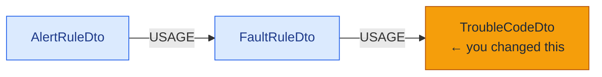
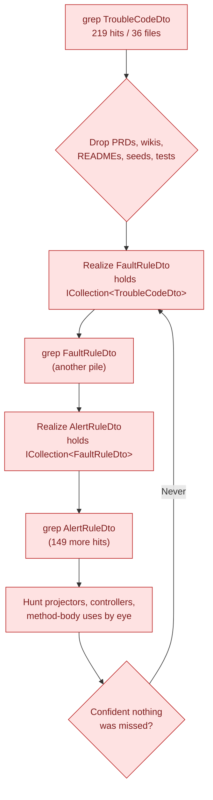
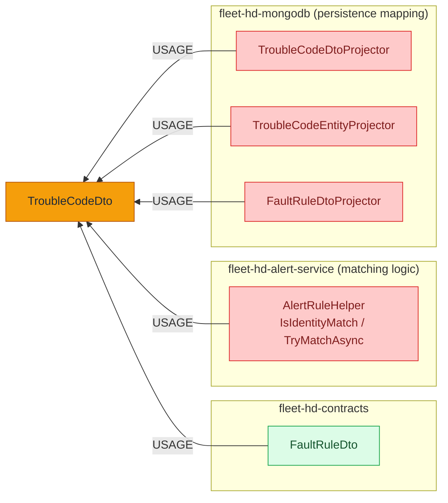
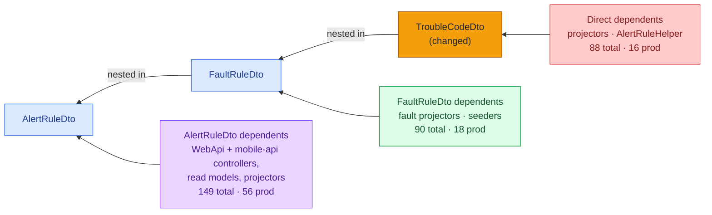
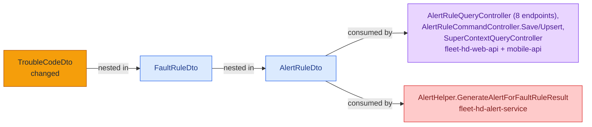

# "I changed `TroubleCodeDto` — now what else needs updating?"

> **Scenario:** the FleetHd platform is ~280 C# repositories. `TroubleCodeDto` is a small,
> deeply-nested DTO defined in `fleet-hd-contracts`. You just changed it — renamed a field,
> changed a type, adjusted matching semantics. The question that decides whether the change is
> safe:
>
> ### *What else has to change with it?*
>
> Text search (`grep`, "Find in Files", IDE symbol search) **cannot answer this** — and, as we'll
> see, neither can a naive one-hop lookup. The real impact is *transitive*, hidden inside two
> layers of container DTOs, and it reaches code that never mentions `TroubleCodeDto` at all. The
> codebase-memory-mcp graph answers it by following dependency edges — *because* it understands C#
> class-level and method-body type references (the local extraction patches).

---

## Why this type is the hard case

`fleet-hd-contracts/src/FleetHd.Contracts/AlertRule/Dto/TroubleCodeDto.cs:5`

```csharp
public class TroubleCodeDto : ICloneable
{
    public string FaultCodeId { get; set; }
    public string Protocol { get; set; }
    public int SourceAddress { get; set; }
    public int FaultCode { get; set; }
    public int FailureCode { get; set; }
    public string FaultType { get; set; }
    public string GroupId { get; set; }
    public int FaultCount { get; set; }
    public TimeSpan Window { get; set; }

    public virtual object Clone() => this.MemberwiseClone();
}
```

`TroubleCodeDto` is a **leaf** — every field is a primitive, so reading its own file tells you
nothing about who depends on it. And it is **buried two container levels deep**:



`AlertRuleDto` holds `ICollection<FaultRuleDto>`; `FaultRuleDto` holds `ICollection<TroubleCodeDto>`.
**So anything that touches an alert rule or a fault rule is transitively affected by this change** —
even though it never names `TroubleCodeDto`, because the type is embedded inside the objects it
serializes, maps, or clones.

---

## ❌ What text search gives you

```text
$ grep -rn "TroubleCodeDto" C:\Users\Max\source\repos
… 219 matches across 36 files …
```

219 unranked hits, mostly *not* the answer — a product PRD, two wiki pages, a README, a planning
doc, seed data, and a wall of test fixtures. Worse: **grep can only find the string.** The code
that actually breaks — a WebApi controller returning an `AlertRuleDto`, a projector mapping a
`FaultRuleDto` — does not contain the text `TroubleCodeDto` anywhere, so grep returns **zero** of
those rows. To find them you'd have to crawl the containment chain by hand:



> **The core problem:** *"X depends on TroubleCodeDto"* is **not text**. It is implied by
> `ICollection<TroubleCodeDto>` two classes up. No regex surfaces a relationship that was never
> written literally.

---

## ✅ What the graph gives you

### Ring 1 — direct dependents

```cypher
MATCH (a)-[:USAGE]->(b {name:'TroubleCodeDto'}) RETURN count(*)                          --> 88

MATCH (a)-[:USAGE]->(b {name:'TroubleCodeDto'})
WHERE NOT (a.file_path CONTAINS 'Test') RETURN count(*)                                  --> 16
```

**88 dependents (16 production, 72 test fixtures.)** The 16 production ones are the code that
names the type directly — the MongoDB projectors (the `Dto ↔ Entity` mapping that *must* change or
persistence breaks) and the fault-matching logic:



### Rings 2–3 — the transitive blast radius (what a one-hop search misses)

The 88 direct dependents are only the inner ring. `TroubleCodeDto` lives inside `FaultRuleDto`,
which lives inside `AlertRuleDto` — so **everything depending on those containers is impacted too:**

| Layer in the chain | total deps | production deps |
|---|---:|---:|
| `TroubleCodeDto` (direct) | 88 | 16 |
| `FaultRuleDto` (1 level up) | 90 | 18 |
| `AlertRuleDto` (2 levels up) | 149 | **56** |



The headline case is the **WebApi**. These endpoints return / accept `AlertRuleDto`, so a change to
`TroubleCodeDto` changes their payloads — yet **not one of them contains the string
`TroubleCodeDto`:**

```cypher
MATCH (m)-[:USAGE]->(ar {name:'AlertRuleDto'})-[:USAGE]->(fr {name:'FaultRuleDto'})
        -[:USAGE]->(tc {name:'TroubleCodeDto'})
WHERE m.file_path CONTAINS 'WebApi' AND NOT (m.file_path CONTAINS 'Test')
RETURN DISTINCT m.name, m.file_path
```

```text
AlertRuleQueryController   BuildSummary, GetAsync, GetSummaryAsync,
                           GetSummaryByFaultCodeFilterAsync, GetSummaryByFaultCodeIdAsync,
                           GetSummaryByFaultCodeIdListAsync, GetSummaryByIdAsync,
                           GetSummaryByIdMultiAsync          (8 endpoints)
AlertRuleCommandController SaveAsync, UpsertAlertAsync
SuperContextQueryController GetAlertRules
                           — all in fleet-hd-web-api (+ mobile-api's AlertRuleQueryController)
```



A pure-text workflow cannot express *"follow the dependency upward across three DTOs and into the
WebApi"* — there is no text pattern for it, and the affected files contain no matching string.

---

## Side by side

| | `grep` / text search | codebase-memory-mcp graph |
|---|---|---|
| **Direct dependents of `TroubleCodeDto`** | 219 hits / 36 files, undifferentiated | 88 (16 production, 72 fixtures), with paths |
| **Transitive dependents** (via `FaultRuleDto`, `AlertRuleDto`) | **not findable** — affected files don't contain the string | followed in one multi-hop query |
| **WebApi endpoints affected** | returns **0** rows | 11 production endpoints across 3 controllers |
| **Persistence mapping** (projectors) | buried among PRDs/wikis/tests | surfaced as direct `USAGE` dependents |
| **Generic type args** (`ICollection<TroubleCodeDto>`) | invisible unless read & parsed by hand | extracted automatically |
| **Production vs test noise** | mixed together | split by query (`NOT file_path CONTAINS 'Test'`) |

---

## Why this works (the enabling fix)

Stock extraction only recorded type references from **function signatures**. C# DTOs express their
dependencies as **class-level properties/fields** (`ICollection<TroubleCodeDto>`) and inside
**method bodies** — so those edges were missing entirely, and the containment chain that makes the
transitive impact visible did not exist in the graph. Two local patches add them:

- **Class-level** property/field type refs → `FaultRuleDto —USAGE→ TroubleCodeDto`, `AlertRuleDto —USAGE→ FaultRuleDto`
- **Method-body** refs (`object_creation`, `typeof`, `cast`) → projector / controller `—USAGE→` DTO

Verified live in the current index:

| Edge pattern | Count |
|---|---|
| `Class —USAGE→ Class` (class-level refs) | 4,972 |
| `Method —USAGE→ Class` (method-body refs) | 25,627 |
| Total `USAGE` edges | 87,668 |

See `docs/LOCAL_PATCHES.md` for the implementation detail.

---

## Reproduce it

```cypher
-- Ring 1: direct dependents (count, then production-only)
MATCH (a)-[:USAGE]->(b {name:'TroubleCodeDto'}) RETURN count(*)
MATCH (a)-[:USAGE]->(b {name:'TroubleCodeDto'}) WHERE NOT (a.file_path CONTAINS 'Test') RETURN count(*)

-- the containment chain that hides it
MATCH (ar {name:'AlertRuleDto'})-[:USAGE]->(fr {name:'FaultRuleDto'})-[:USAGE]->(tc {name:'TroubleCodeDto'})
RETURN ar.name, fr.name, tc.name

-- Rings 2–3: dependents of the containers (transitively affected)
MATCH (a)-[:USAGE]->(b {name:'FaultRuleDto'}) WHERE NOT (a.file_path CONTAINS 'Test') RETURN count(*)
MATCH (a)-[:USAGE]->(b {name:'AlertRuleDto'}) WHERE NOT (a.file_path CONTAINS 'Test') RETURN count(*)

-- the WebApi endpoints that never mention TroubleCodeDto but are affected
MATCH (m)-[:USAGE]->(ar {name:'AlertRuleDto'})-[:USAGE]->(fr {name:'FaultRuleDto'})
        -[:USAGE]->(tc {name:'TroubleCodeDto'})
WHERE m.file_path CONTAINS 'WebApi' AND NOT (m.file_path CONTAINS 'Test')
RETURN DISTINCT m.name, m.file_path
```

> Run via the `query_graph` MCP tool (project `C-Users-Max-source-repos`), or any agent wired to
> codebase-memory-mcp. All numbers in this document are from a live index of the FleetHd repos.
